<div align="center">


# Glosy

### Developing a Mobile-Assisted Language Learning Application Utilizing Short-Form Video Reels and Hypercasual Games

*BSc Thesis · Ionian University*

[](manuscript/thesis.pdf)
[](https://github.com/Matin-Marzie/Glosy/releases/latest/download/app-release.apk)

[](https://creativecommons.org/licenses/by-nc-sa/4.0/)

</div>

---

## 📱 Download the App (Android)

Grab the APK from the badge above or from the [Releases page](https://github.com/Matin-Marzie/Glosy/releases/latest).

Open the link on your phone, download the APK, and install it.

> [!NOTE]
> You may need to allow installs from your browser/file manager in Android's settings.

## 🧭 How It Works

<p align="center">
  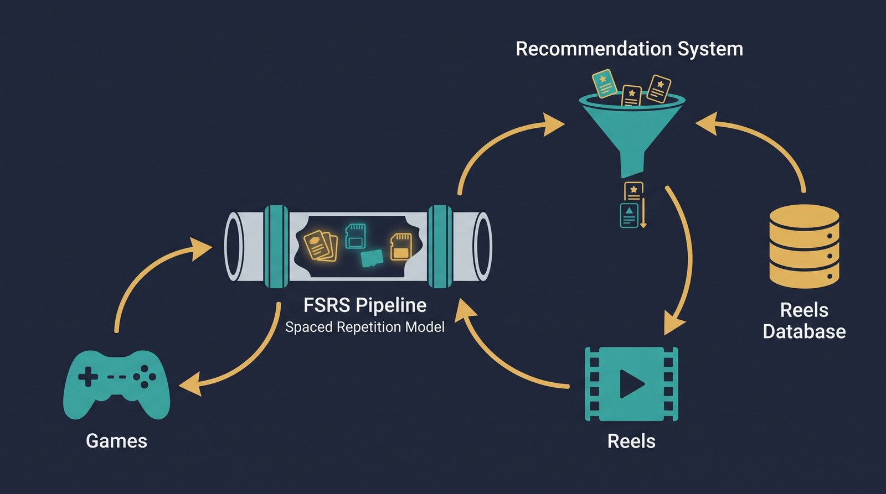
</p>

Reels and games, driven by one word-level learner model.

### 🚀 Onboarding

<table align="center">
  <tr>
    <td align="center">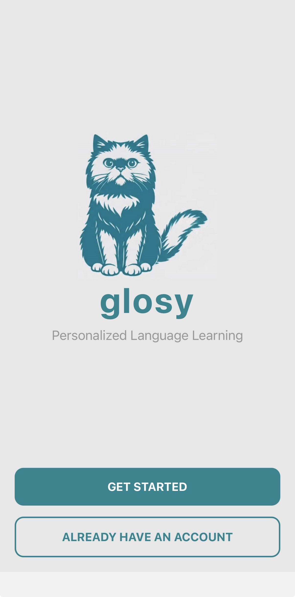<br><sub>1 · Welcome (light mode)</sub></td>
    <td align="center">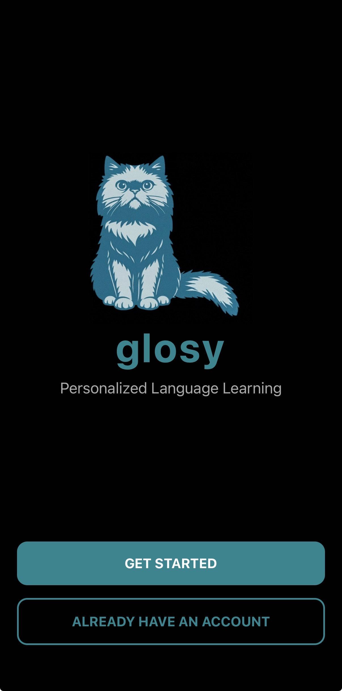<br><sub>2 · Welcome (dark mode)</sub></td>
    <td align="center">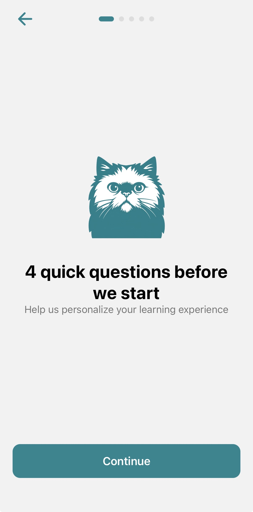<br><sub>3 · Before we start</sub></td>
    <td align="center">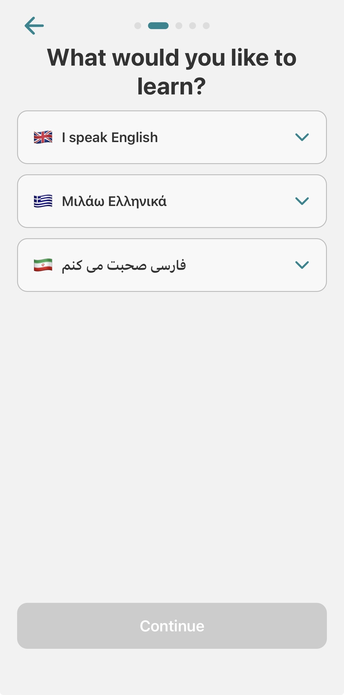<br><sub>4 · Native language</sub></td>
  </tr>
  <tr>
    <td align="center">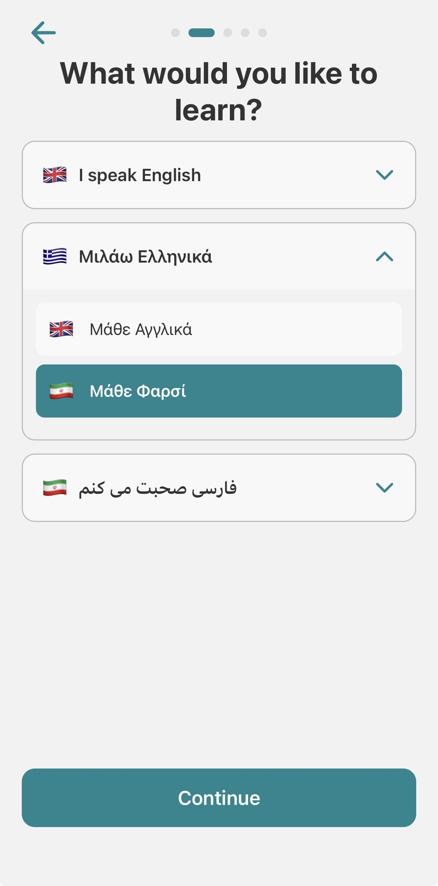<br><sub>5 · Learning language</sub></td>
    <td align="center">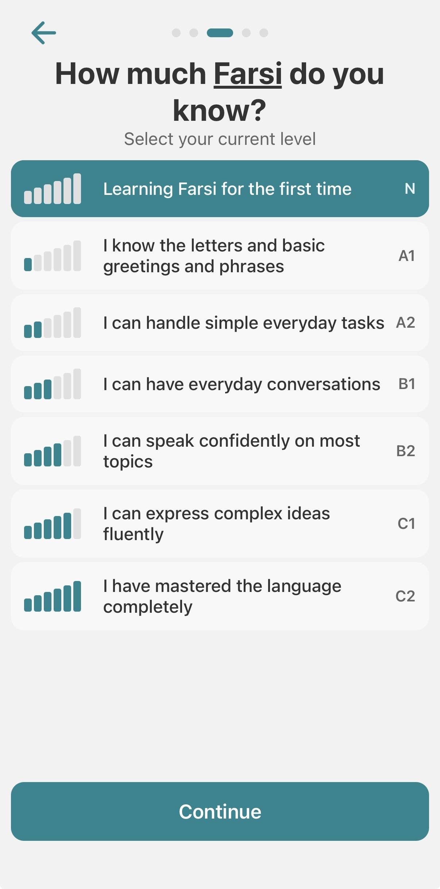<br><sub>6 · Proficiency level</sub></td>
    <td align="center">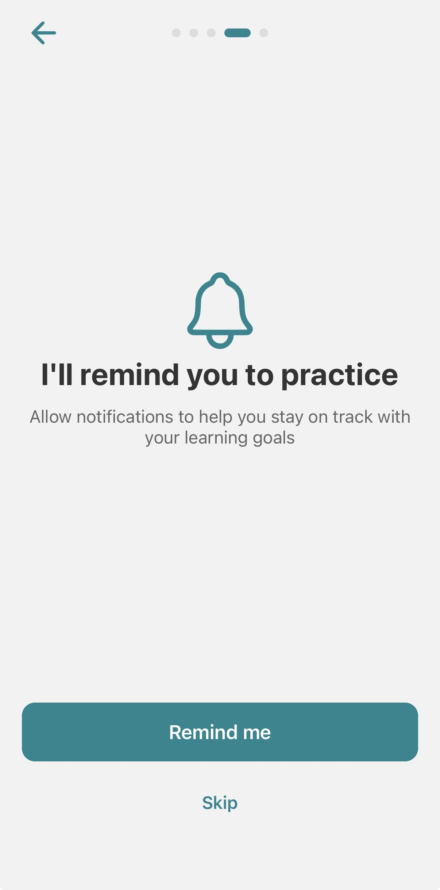<br><sub>7 · Notifications</sub></td>
    <td align="center">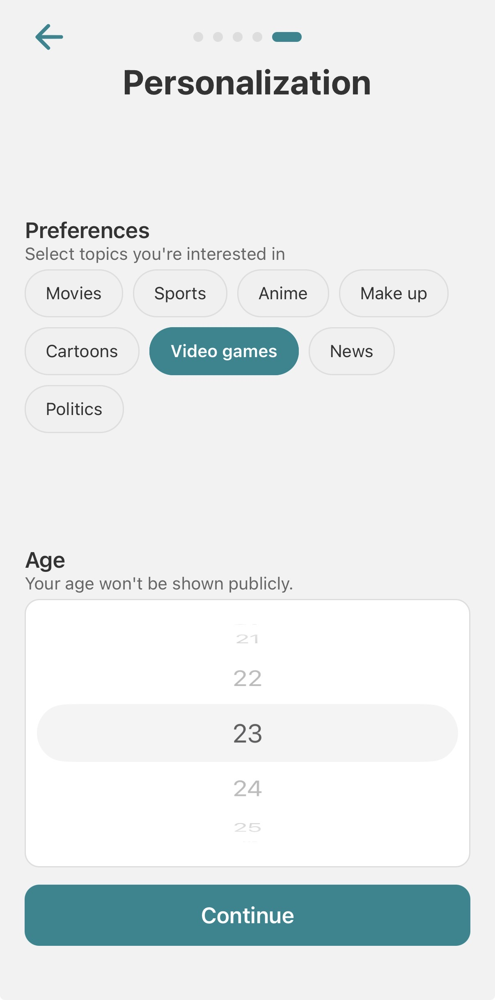<br><sub>8 · Personalization</sub></td>
  </tr>
</table>

### 🧠 Spaced Repetition Input & Reels

<table align="center">
  <tr>
    <td align="center">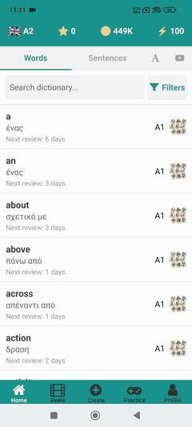<br><sub>Vocabulary · due dates</sub></td>
    <td align="center"><br><sub>Reels feed</sub></td>
    <td align="center">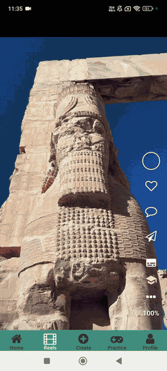<br><sub>Reels feed</sub></td>
  </tr>
</table>

### 🎬 Create a Reel

<table align="center">
  <tr>
    <td align="center">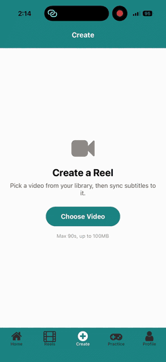<br><sub>1 · Choose a video</sub></td>
    <td align="center">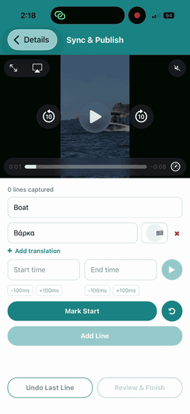<br><sub>2 · Sync each line</sub></td>
    <td align="center">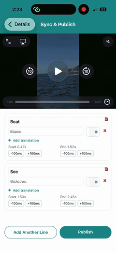<br><sub>3 · Review &amp; publish</sub></td>
  </tr>
</table>

### 🟩 Wordle-style Game

<table align="center">
  <tr>
    <td align="center">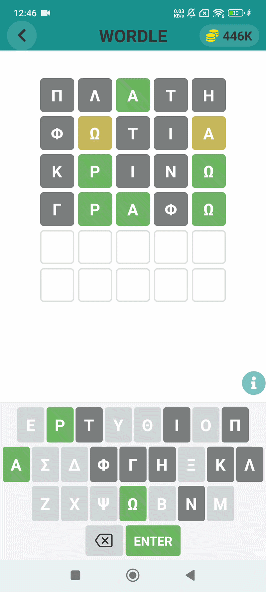<br><sub>Greek Wordle round</sub></td>
    <td align="center">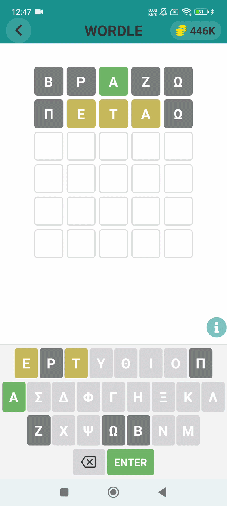<br><sub>Greek Wordle round</sub></td>
  </tr>
</table>

### 🔤 Play With Letters (Word of Wonders)

<table align="center">
  <tr>
    <td align="center">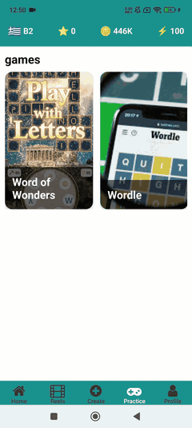<br><sub>Games hub</sub></td>
    <td align="center">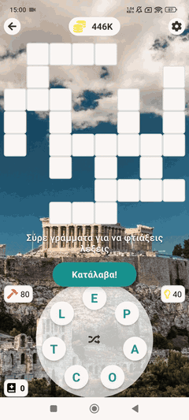<br><sub>Empty board</sub></td>
    <td align="center">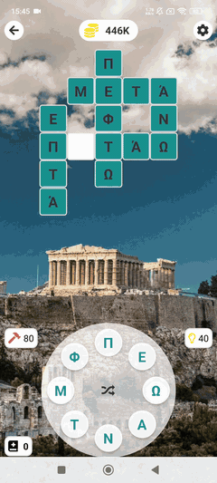<br><sub>Words placed</sub></td>
  </tr>
</table>

## 💻 Run It Locally

### 🧰 Prerequisites

- Node.js 20.19.4+ & npm
- Python 3.11+ (for the reels service)
- PostgreSQL 18
- Git
- [Expo Go](https://expo.dev/go) installed on your Android or iOS phone

### 📥 Clone the Repository

```bash
git clone https://github.com/Matin-Marzie/bsc_thesis_ionian_university
cd bsc_thesis_ionian_university
```

### 🗄️ Database Setup

Create the database and user, then load the schema and data:

```bash
# Create user and database (defaults used by the backend and reels service)
# (macOS/Homebrew: replace "sudo -u postgres psql" with "psql postgres")
# (Windows: replace "sudo -u postgres psql" with "psql -U postgres")
sudo -u postgres psql -c "CREATE USER root WITH PASSWORD '1234';"
sudo -u postgres psql -c "CREATE DATABASE thesis_db OWNER root;"

# Load schema, then data
psql -h localhost -U root -d thesis_db -f database/glosy_structure.sql
psql -h localhost -U root -d thesis_db -f database/glosy_data.sql
```

> [!NOTE]
> The dumps already include every migration in `database/migrations/`, and they need PostgreSQL 18's `psql` to load.

The backend reads its database settings from `backend/.env` (`DB_HOST`, `DB_PORT`, `DB_NAME`, `DB_USER`, `DB_PASSWORD`).

### 🖥️ Backend Setup

In `backend/.env`, set `ACCESS_TOKEN_SECRET` and `REFRESH_TOKEN_SECRET` to any long random strings, and copy the same `ACCESS_TOKEN_SECRET` into `reels-service/.env`.

Open a new terminal in the `bsc_thesis_ionian_university` folder:

```bash
# Navigate to backend directory
cd backend

# Install dependencies
npm install

# Start development server
npm run dev
```

- Backend: `http://localhost:3500`
- API documentation: `http://localhost:3500/swagger`

### 🎬 Reels Service Setup

Requires Python 3.11+ and a running PostgreSQL database.

Open a new terminal in the `bsc_thesis_ionian_university` folder:

```bash
# Navigate to reels-service directory
cd reels-service

# Create and activate a virtual environment
python3 -m venv venv  # On Windows: python -m venv venv
source venv/bin/activate  # On Windows: venv\Scripts\activate (PowerShell: venv\Scripts\Activate.ps1)

# Install dependencies
pip install -r requirements.txt

# Start development server
python3 main.py  # On Windows: python main.py
```

- Reels service: `http://localhost:3600`
- API documentation: `http://localhost:3600/docs`

### 📲 Frontend Setup

In `frontend/.env`, replace `COMPUTER_IP_ADDRESS` with your computer's local IP address (for example `192.168.1.20`).

Open a new terminal in the `bsc_thesis_ionian_university` folder:

```bash
# Navigate to frontend directory
cd frontend

# Install dependencies
npm install

# Start development server
npx expo start
```

Then open the app on your phone with Expo Go:

- **Android:** open the Expo Go app and scan the QR code shown in the terminal.
- **iOS:** scan the QR code with the Camera app, then tap the link to open it in Expo Go.

> [!NOTE]
> Your phone and computer must be on the same Wi-Fi network.

> [!IMPORTANT]
> Google Sign-In needs a native build (development build or the release APK), so it is commented out in `frontend/app/onboarding/login.tsx` and `register.tsx` for Expo Go. Use email sign-up instead.

## 📜 License

This work is licensed under a [Creative Commons Attribution-NonCommercial-ShareAlike 4.0 International License](https://creativecommons.org/licenses/by-nc-sa/4.0/).
